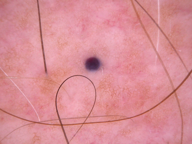

# Medical Imaging (Project Summary)

## Project background
Skin cancer is one of the most common cancers around the world. It affects approximately 300 thousand people every year, with Denmark being in the top 5 countries with the most cases per population (Source: https://www.wcrf.org/preventing-cancer/cancer-statistics/skin-cancer-statistics/).

Thankfully, even though skin cancer can be fatal, early detection dramatically improves the survival rates of patients. Ideally, regular screenings would be available to everyone, but in reality, this is not always feasible. Dermatologists are not accessible everywhere and if they are, frequent dermatologist visits are also not desirable due to economic reasons. 

This project is focused on improving the skin detection process by optimizing the time medical professionals spend evaluating whether skin lesions are cancerous.  Instead of relying solely on human assessment, the goal it to use a machine learning algorithm to automate and quicken the diagnosis process, making early detection more efficient and accessible.

## Dataset description
As said prior, a key part of early detection is a review of the skin lesion that is thought to be cancerous. Eventhough, this is predominantly done by dermatologists, developing an automated programme can result in a more efficient and accessible check up for the patient. To create a useful model, we need it to be highly accurate. In order to do so we must analyse diverse types of skin lesions and this is represented in the dataset we are provided. The skin lesions photographed are of different shapes, colors and textures, which will expose the model to different types of cancerous lesions thus making its verdict more robust. The images in the dataset are also all of similar quality which is ideal for the model. To efficiently analyse the skin lesion dataset, first we will need to cleanup any distractions off the skin lesions which can degrade the model's accuracy. Most common example of this, is the hair present in the region of the patient's skin lesion. The patient's hair can obstruct the lesion and confuse the model, or thus comprimising the models verdict. To combat this problem, we will need to remove the hair off the images before we can allow the model to evaluate it. 

## Image annotations
An important component of this project is the annotation of the amount of hair in the provided pictures. All 5 members of our group have individually rated all 200 pictures on a scale from 0-2, 0 meaning no hair in the picture, 1 meaning some hair, and 2 meaning a lot of hair. Later in the project, these annotations will serve as input for model training and further analysis. Also, from these annotations we can measure inter-observer consistency between different annotators and intra-observer consistency for the same annotator. For measuring the inter-observer consistency, Cohens Kappa can be used to measure how much the annotations of two annotators agree.

## Segmentation of skin lesions
 text here 

 ## Conclusions and reflection
 Some conclusions that wer
 Ideas - Removed the image, helps the model so that the skin lesion is not obstructed, but it affects the color and sometimes the size of the lesion, which will also inherently affect the result that the model gives. 

FINAL BULLET POINTS- 

Good Examples

The presence of hair in an image can potentially influence the performance of a machine learning algorithm. To avoid this issue, we applied a hair removal algorithm to preprocess the images. The algorithm processes a selected set of images and returns hair-free versions while preserving other relevant details.

Upon reviewing the results, we observed that the algorithm performs well in some cases but encounters challenges in others. Specifically, it is effective at removing dark hairs, both in images with minimal hair (see Example 1) and those with significant hair coverage (see Example 2).

However, it is crucial that the mole remains visible and retains all features necessary for accurate classification. Some successfully processed images appear slightly blurred, with certain areas looking lighter than in the original. To address this, incorporating a denoising step in future processing may help improve image clarity.

Additionally, when evaluating moles, we must consider these modifications, as essential features could be unintentionally altered or removed, potentially affecting diagnostic accuracy

1180 - we can use blur cleaner to fix it
1186
1191 - lot of hair removed

Bad Examples- 

White hairs not removed
img 1287

Bad Example: Size and shape of mole changed due to hair segmentation 
When looking through our pictures, we also noticed that some of the moles change size and shape after the hair removal. Otherwise "perfectly" round moles suddenly have the shape of a cross. An example of this is visibly seen in the before and after of image 1362. 

| Before | After |
|---------|---------|
|  |  |

As the pictures show, something in the hair segmentation process is recognising some parts of the mole as hair. This could have to do with the mole having the same color as the hair in the photo, or 

the mole has same color as the hair - brush thing

cross examples (adds asymetry)
img 1362
img 1369 
Lot of hair removed but size changed
img 1181
 

 
